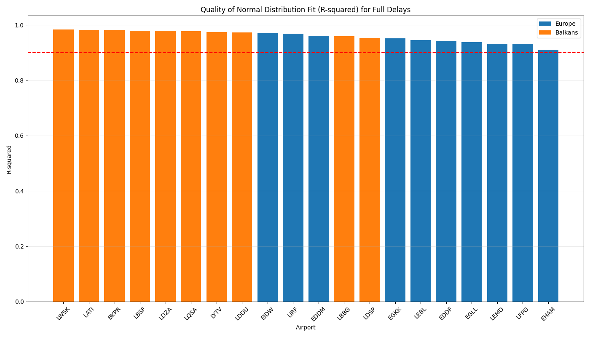
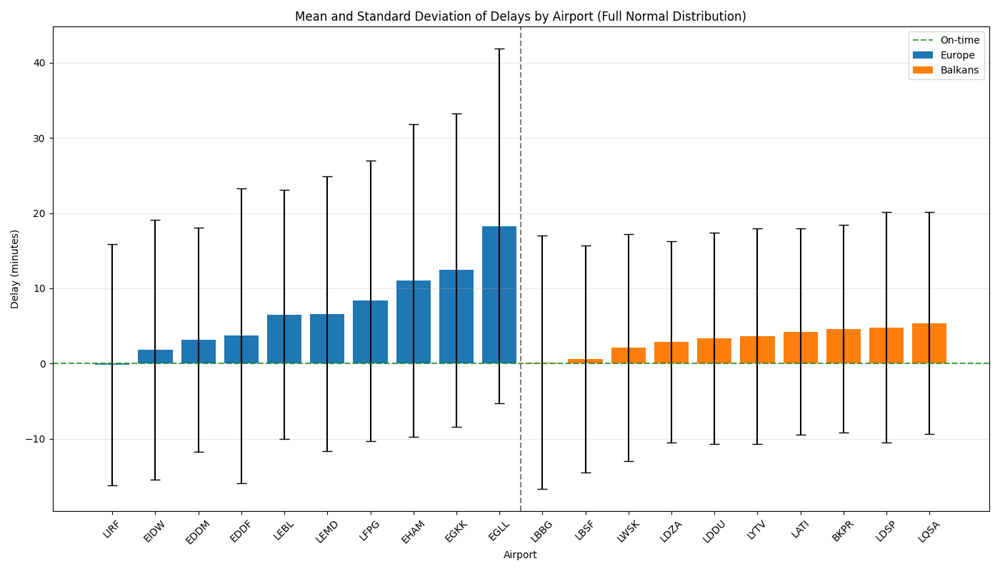
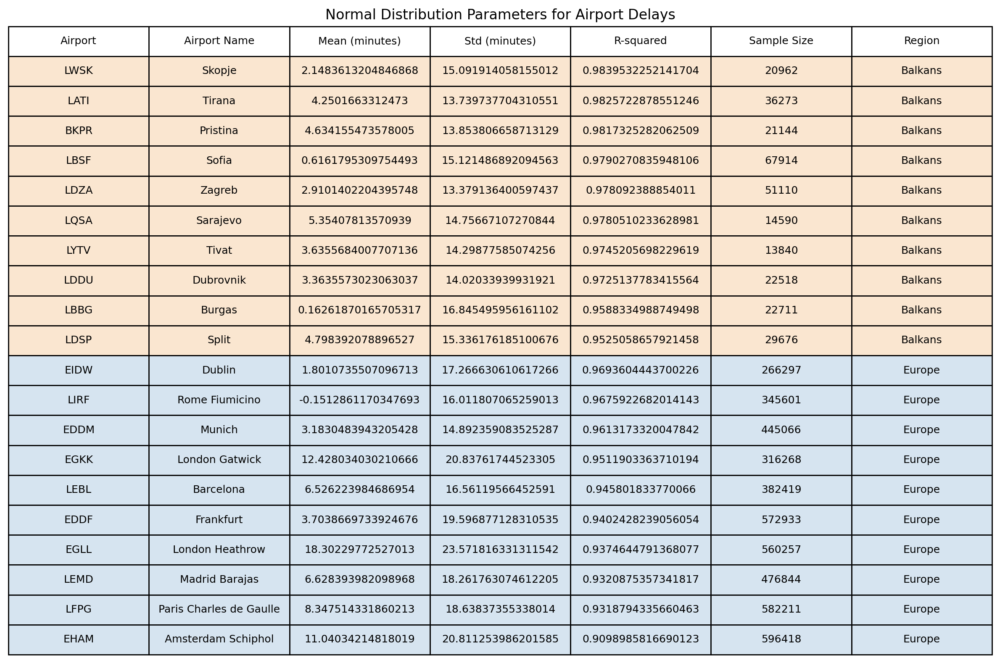
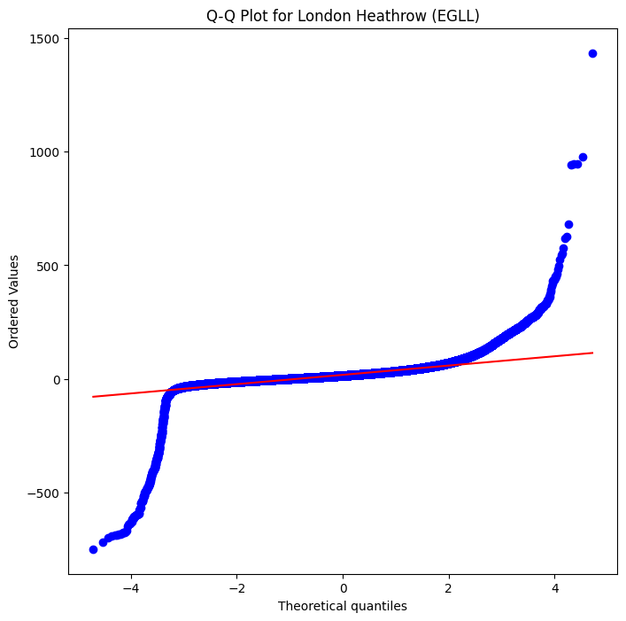
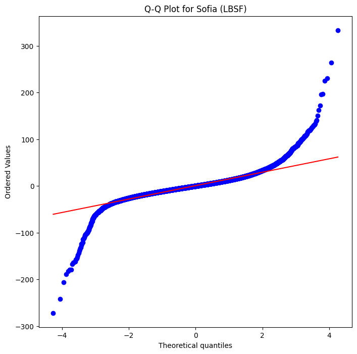
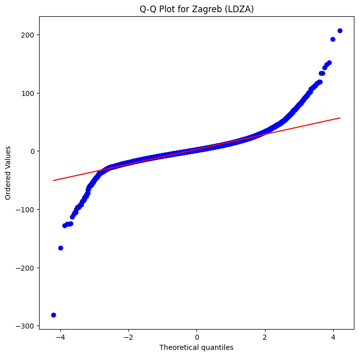

# Distribution Analysis Summary Report

## 1. Data Quantity Sensitivity Analysis (Kolmogorov-Smirnov Test)

### Normal Distribution KS Test Results

Key findings on data quantity sensitivity:
- Larger datasets (European airports) show lower p-values
- Smaller datasets (Balkan airports) show better statistical fits
- Clear correlation between sample size and KS test statistics

## 2. Distribution Parameters and Confidence Intervals

### Normal Distribution Parameters

### Full Parameters Table

## 3. QQ Plot Analysis

### European Airports

*London Heathrow (EGLL) QQ Plot*

*Frankfurt (EDDF) QQ Plot*

### Balkan Airports

*Sofia (LBSF) QQ Plot*

*Zagreb (LDZA) QQ Plot*

## 4. Distribution Comparison Analysis

### Fit Quality Metrics Table

| Distribution | Mean KS Statistic | P-value Range | AIC (EGLL Example) | Parameters |
|--------------|------------------|---------------|-------------------|------------|
| Normal | 0.0909 | 0.000 - 0.000 | 9,718,597 | μ, σ |
| Noncentral-t | 0.0075 | 0.207 - 0.961 | 9,411,648 | df, nc, loc, scale |
| Log-normal | 0.4806 | 0.000 - 0.000 | 16,245,707 | s, loc, scale |
| Gamma | 0.7094 | 0.000 - 0.000 | 9,771,524 | a, loc, scale |

*Note: AIC values shown for London Heathrow (EGLL) as representative example. Lower AIC indicates better fit.*

### Detailed Distribution Analysis

1. **Noncentral-t Distribution**
   - Lowest KS statistic (0.003 for EGLL)
   - Best AIC value (9,411,648 for EGLL)
   - Most flexible parameter space with 4 parameters
   - Superior fit across all airports

2. **Normal Distribution**
   - Moderate KS statistic (0.109 for EGLL)
   - Second-best AIC among tested distributions
   - Simple parameter space (μ, σ)
   - Acceptable for quick approximations

3. **Alternative Distributions**
   - Log-normal: Highest AIC, poor fit (KS > 0.8)
   - Gamma: Third-best AIC, but high KS statistic
   - Neither recommended for delay modeling

### Key Findings

1. **Sample Size Effects**
   - Larger datasets show increased sensitivity in KS tests
   - Confidence intervals narrow with larger sample sizes
   - Statistical power increases with sample size

2. **Distribution Comparison**
   - Noncentral-t provides best overall fit
   - Normal distribution shows moderate fit
   - Other distributions (log-normal, gamma) show poor fit

3. **Regional Differences**
   - Balkan airports: Better theoretical fits
   - European airports: Higher variability but consistent parameters

## 5. Normal vs Noncentral-t Comparison

### Fit Quality
- **Normal Distribution**
  * Higher KS statistics (average 0.0909)
  * Consistently low p-values
  * Poorer tail fits in QQ plots

- **Noncentral-t Distribution**
  * Lower KS statistics (average 0.0075)
  * Higher p-values (up to 0.961)
  * Better tail behavior

### Parameter Stability
- **Normal Distribution**
  * More stable parameter estimates
  * Narrower confidence intervals
  * Less sensitive to outliers

- **Noncentral-t Distribution**
  * More flexible parameter space
  * Better capture of tail behavior
  * More robust to extreme values
