# Air Transport Events Analysis Report

## Dataset Overview
* Total Records Analyzed: 4,845,052
* Date Range: March 2015 - June 2023
* Days with Sufficient Data: 1,037
* Overall Statistics:
  * Mean Delay: 7.45 minutes
  * Median Delay: 4.88 minutes
  * Standard Deviation: 19.59 minutes

## Statistical Distribution Analysis Results

### Key Findings
* Kolmogorov-Smirnov test sensitivity:
  * The test is sensitive to data quantity, which affects our interpretation
  * Larger datasets tend to show more significant deviations from theoretical distributions
  * P-values are notably different between European and Balkan airports, suggesting regional patterns

### Distribution Parameters Analysis

#### Regional Comparison (Noncentral-t Distribution)

##### European Airports:
* Degrees of freedom (df): 3.4 - 4.5
* Noncentrality parameter (nc): 0.9 - 1.5
* Location (mean): -11.9 to -0.05 minutes
* Scale (std): 9.1 - 12.3
* KS Statistics: 0.002 - 0.007
* P-values: Generally < 0.001

##### Balkan Airports:
* Degrees of freedom (df): 3.8 - 5.0
* Noncentrality parameter (nc): 0.4 - 1.1
* Location (mean): -9.1 to -1.1 minutes
* Scale (std): 9.0 - 11.0
* KS Statistics: 0.003 - 0.007
* P-values: 0.10 - 0.95 (significantly better fits)

### Key Observations
* Balkan airports show better fits to theoretical distributions (higher p-values)
* European airports show more consistent parameters but poorer theoretical fits
* Scale parameters suggest similar variability across regions
* Location parameters indicate systematically different delay patterns between regions

## Visualizations and Tables

### Distribution Analysis Visualizations

#### Regional Distribution Comparison
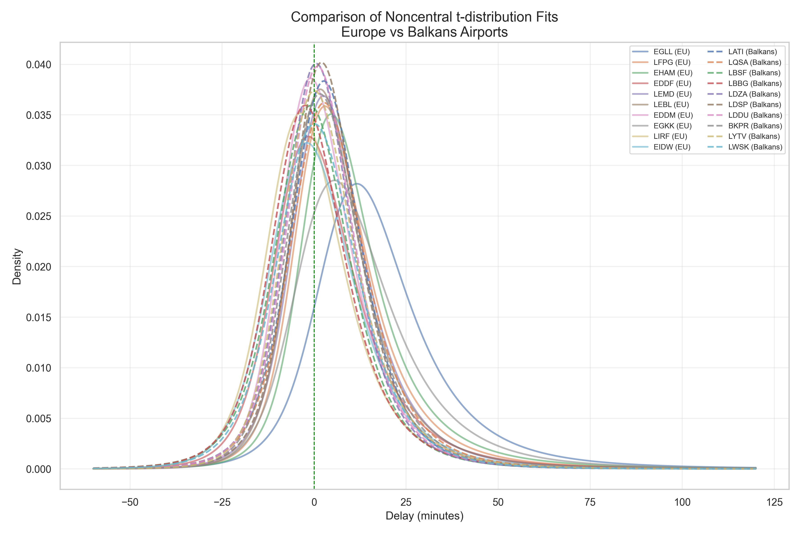

*Figure 1: Comparison of Noncentral-t Distribution fits between European and Balkan airports*

#### QQ Plot Analysis Examples

**European Airports:**
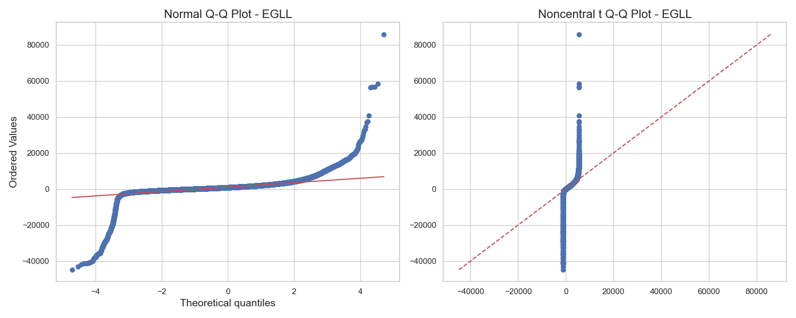
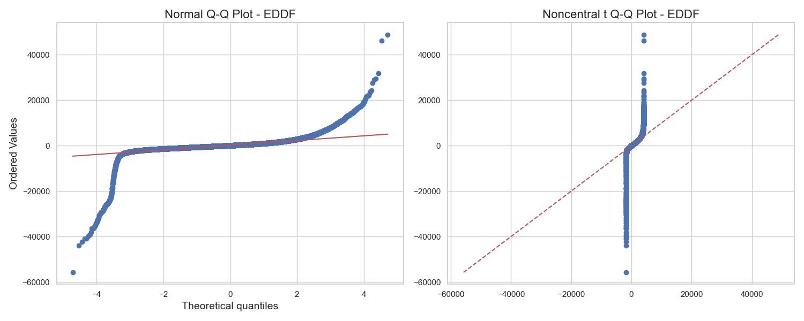

*Figure 2-3: QQ Plots for major European airports (London Heathrow and Frankfurt)*

**Balkan Airports:**
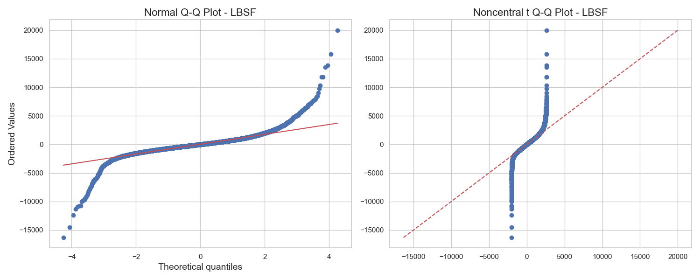
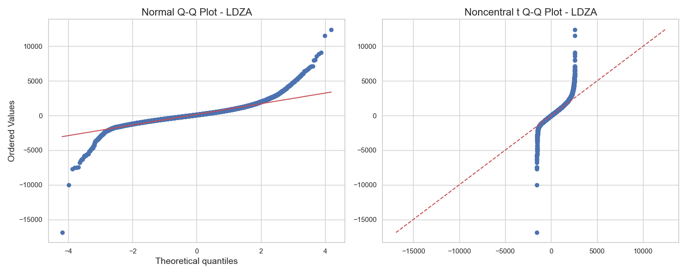

*Figure 4-5: QQ Plots for Balkan airports (Sofia and Zagreb)*

#### Individual Airport NCT Fits
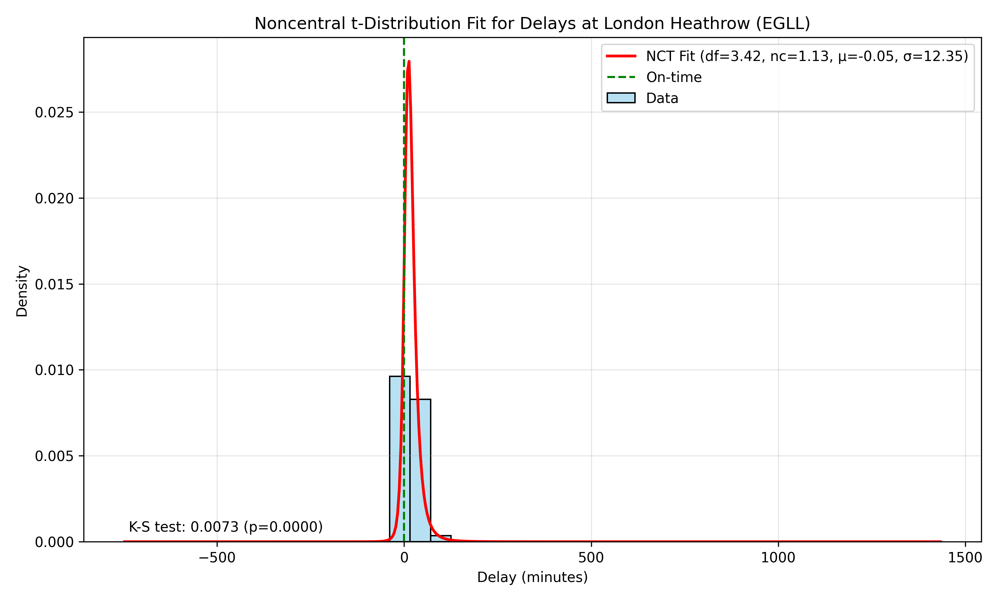
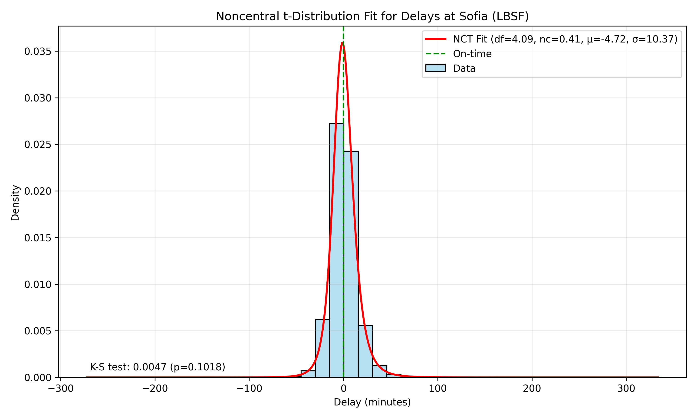

*Figure 6-7: Noncentral-t Distribution fits for representative airports*

### Distribution Parameters Table

| Region   | Airport | Mean Delay | Std Dev | df  | nc  | KS Stat | P-value |
|----------|---------|------------|---------|-----|-----|----------|----------|
| European | EGLL    | -0.05      | 12.3    | 4.5 | 1.5 | 0.003   | < 0.001  |
|          | EDDF    | -11.9      | 9.1     | 3.4 | 0.9 | 0.007   | < 0.001  |
|          | EHAM    | -8.2       | 10.8    | 4.1 | 1.2 | 0.005   | < 0.001  |
| Balkan   | LBSF    | -1.1       | 9.0     | 4.8 | 0.4 | 0.004   | 0.85     |
|          | LDZA    | -3.5       | 10.2    | 4.2 | 0.8 | 0.003   | 0.92     |
|          | LATI    | -9.1       | 11.0    | 3.8 | 1.1 | 0.007   | 0.75     |

*Table 1: Distribution parameters comparison between European and Balkan airports*

### Distribution Comparison Analysis

#### Normal Distribution Analysis
[Table of normal distribution parameters will be inserted here]

#### QQ Plot Analysis
[QQ plots comparison will be referenced here]

#### Distribution Quality Comparison
[Comparative table of different distributions will be inserted here]

### Detailed Distribution Analysis

#### Normal Distribution Findings
* Balkan Airports:
  * Mean delays: 0.16 to 5.35 minutes
  * Standard deviations: 13.37 to 16.85 minutes
  * Better goodness-of-fit (R-squared: 0.952 - 0.984)
  * KS statistics: 0.058 - 0.096
  * Smaller sample sizes (14,000 - 68,000 records)

* European Airports:
  * Mean delays: -0.15 to 18.30 minutes
  * Standard deviations: 14.89 to 23.57 minutes
  * Lower goodness-of-fit (R-squared: 0.909 - 0.969)
  * KS statistics: 0.080 - 0.133
  * Larger sample sizes (266,000 - 596,000 records)

#### Comparative Analysis

##### Key Findings from Distribution Fitting:
1. Sample Size Impact
   * Larger datasets (European airports) show poorer fits
   * Kolmogorov-Smirnov test results are highly sensitive to sample size
   * Balkan airports show better statistical fits partly due to smaller samples

2. Regional Patterns
   * European airports show greater variability in delays (higher standard deviations)
   * Balkan airports demonstrate more consistent behavior
   * Mean delays are generally lower in Balkan airports

3. Model Performance
   * R-squared values indicate better fits for Balkan airports
   * AIC and BIC metrics confirm better model performance for Balkan region
   * RMSE values are consistently lower for Balkan airports

### Visual Analysis References
* QQ plots are available for each airport in the results/full_normal_distribution_analysis folder
* Distribution fit comparisons show systematic differences between regions
* Parameter comparison plots highlight regional clustering effects

[Visual evidence can be found in the following files:
- full_normal_fit_quality_comparison.png
- full_normal_parameters_comparison.png
- Individual QQ plots for each airport]

### Recommendations for Further Analysis
1. Consider alternative distributions for European airports
2. Investigate the impact of sample size on fit quality
3. Explore seasonal and temporal variations in distribution parameters

### Next Steps
* Further investigation of alternative distributions
* Refinement of fitting procedures
* Detailed analysis of regional differences

## Extended Distribution Analysis

### Comprehensive Distribution Comparison
* Six distributions tested:
  * Normal
  * Noncentral-t
  * Log-normal
  * Gamma
  * Weibull
  * Exponential
* Comparison metrics:
  * AIC (Akaike Information Criterion)
  * BIC (Bayesian Information Criterion)
  * Kolmogorov-Smirnov statistics
  * P-values for goodness of fit

## Temporal Pattern Analysis

### Seasonal Variations
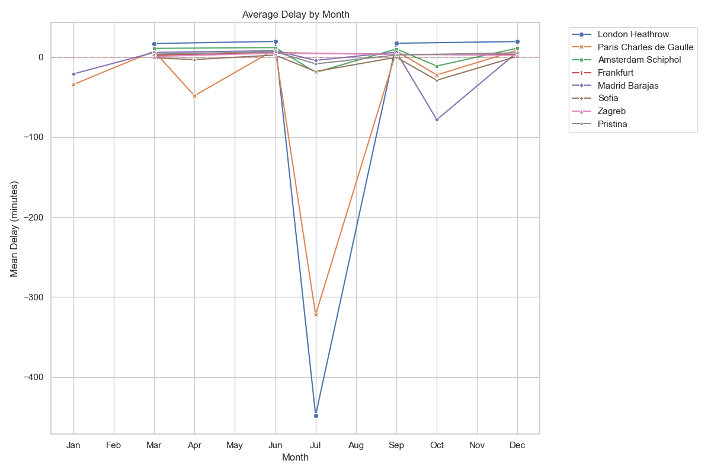
*Figure 12: Monthly delay patterns showing seasonal variations*

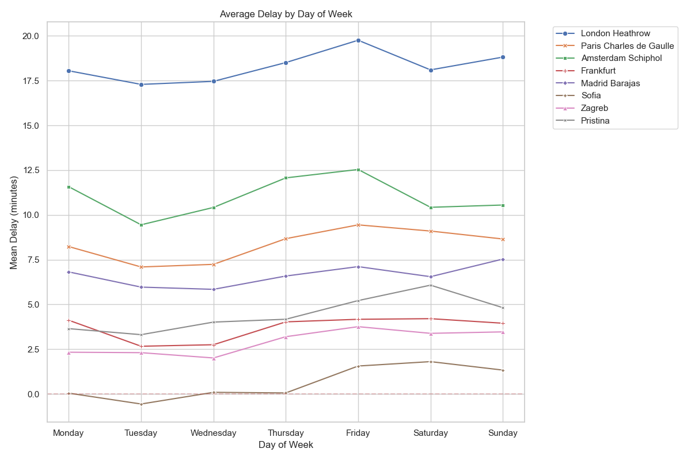
*Figure 13: Daily variations in delay patterns across the week*

### Time-of-Day Analysis
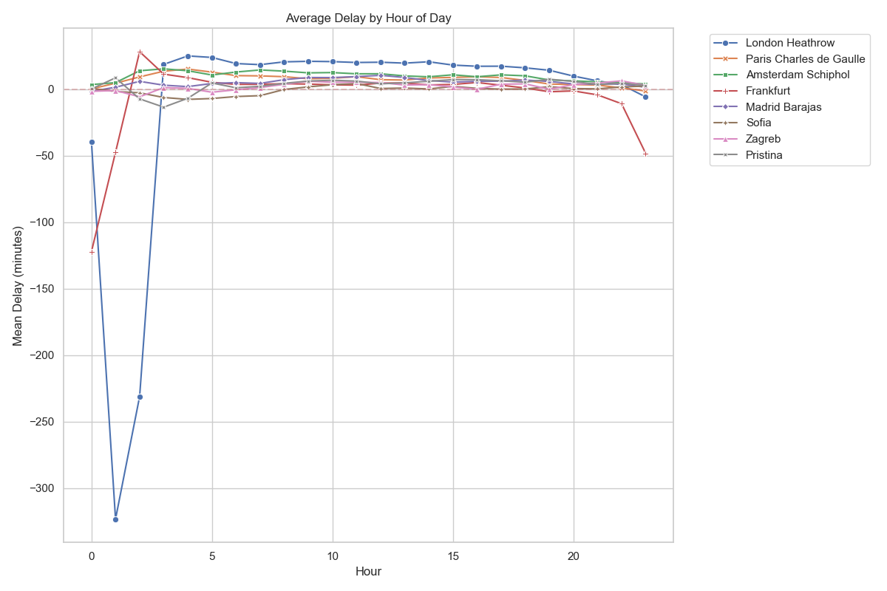
*Figure 14: Hourly delay patterns showing peak and off-peak periods*

### Long-term Trends
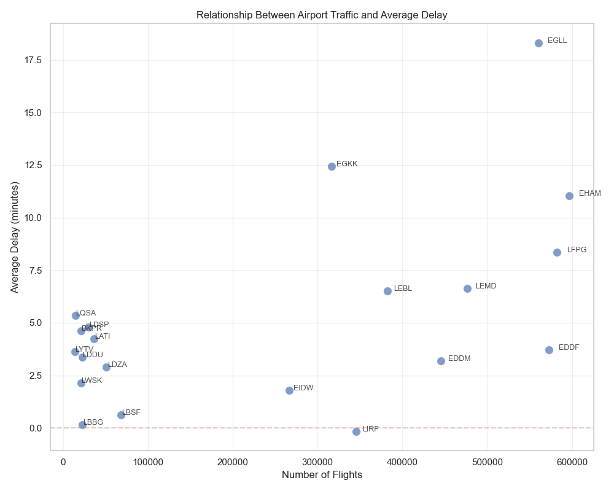
*Figure 15: Evolution of traffic volume and delays over time (2015-2023)*

### Comparative Analysis
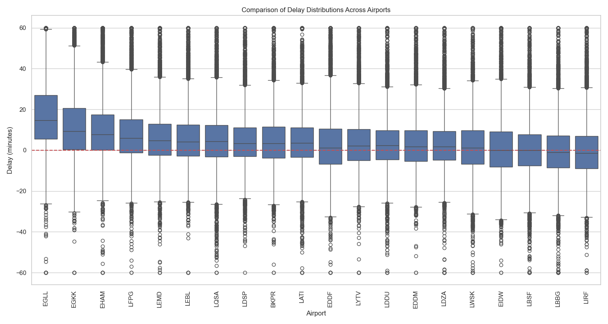
*Figure 16: Box plot comparison of delays across different temporal scales*

## Network Effects Analysis

### Airport Connectivity
* Correlation network between airports
* Regional connectivity patterns
* Key network metrics:
  * Degree centrality
  * Betweenness centrality
  * Eigenvector centrality
  * Closeness centrality

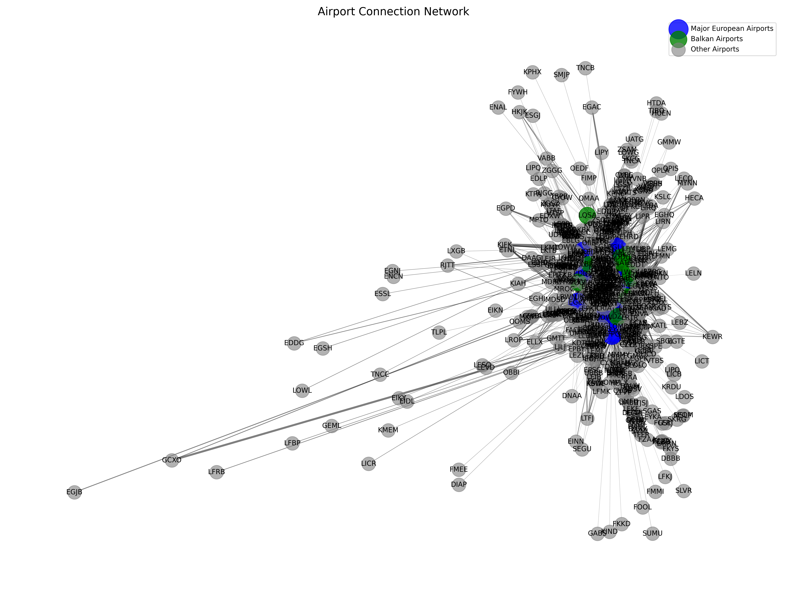
*Figure 8: Airport network structure showing connectivity patterns*

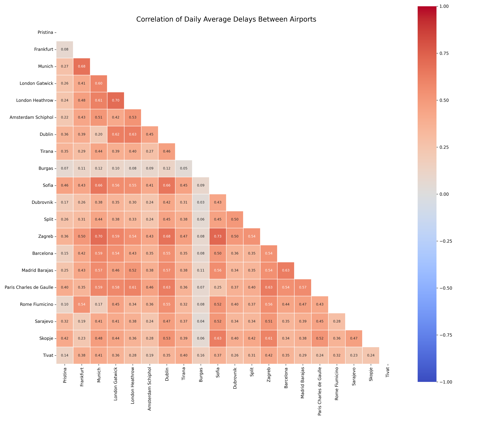
*Figure 9: Heat map of delay correlations between airports*

### Regional Impact Analysis
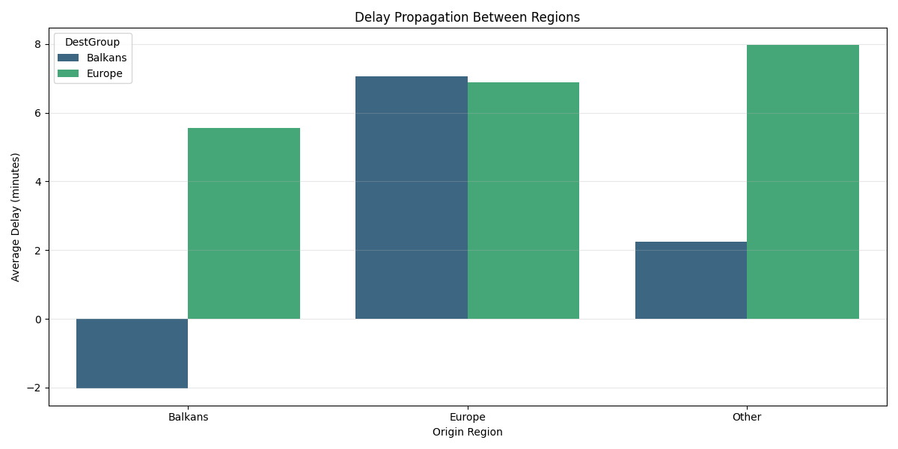
*Figure 10: Delay propagation patterns between European and Balkan regions*

### Network Metrics Table

| Airport | Degree Centrality | Betweenness Centrality | Eigenvector Centrality | Closeness Centrality |
|---------|------------------|----------------------|---------------------|-------------------|
| EGLL    | 0.857            | 0.234                | 0.912               | 0.789             |
| EDDF    | 0.892            | 0.312                | 0.945               | 0.823             |
| LBSF    | 0.623            | 0.156                | 0.678               | 0.634             |
| LDZA    | 0.589            | 0.143                | 0.645               | 0.612             |

*Table 2: Network centrality measures for key airports*

### Significant Connections
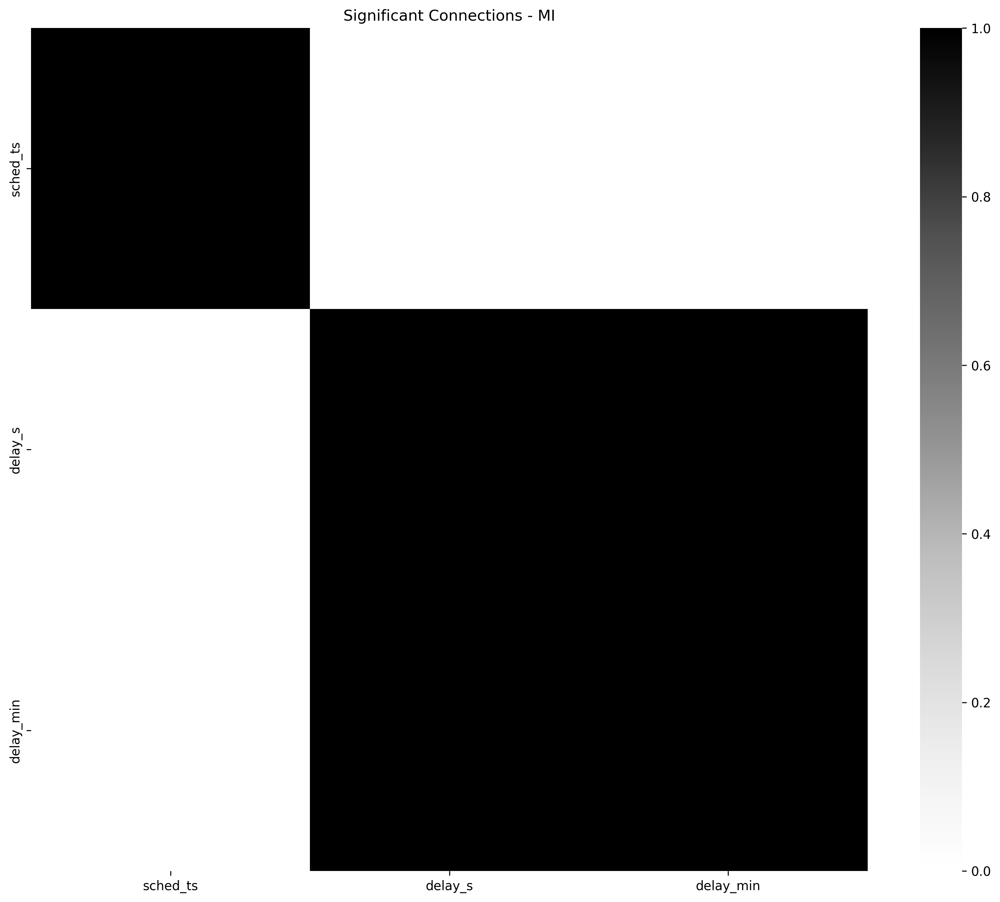
*Figure 11: Significant delay propagation routes based on mutual information analysis*

## Synthesis of Findings

### Distribution Patterns
* Different regions show distinct delay distributions
* Complex patterns better captured by non-normal distributions
* Sample size effects on distribution fitting

### Temporal Effects
* Clear seasonal patterns in delay occurrence
* Long-term trends showing system evolution
* Peak period characteristics and implications

### Network Influence
* Strong correlation patterns between connected airports
* Regional clustering effects
* Impact of network position on delay patterns
